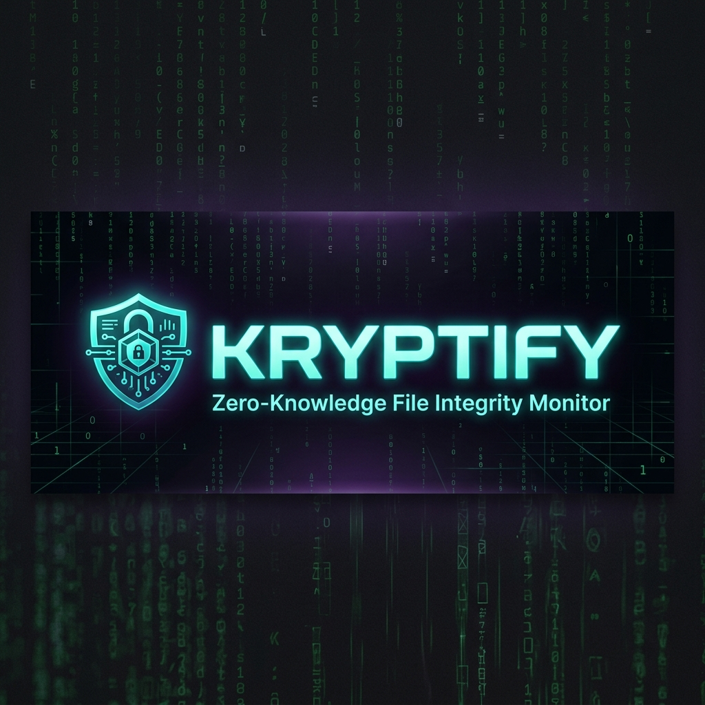
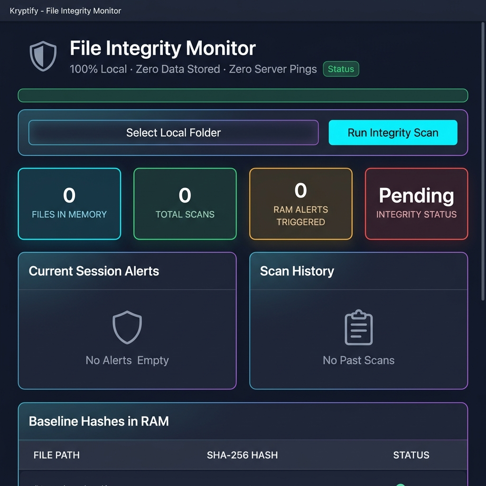
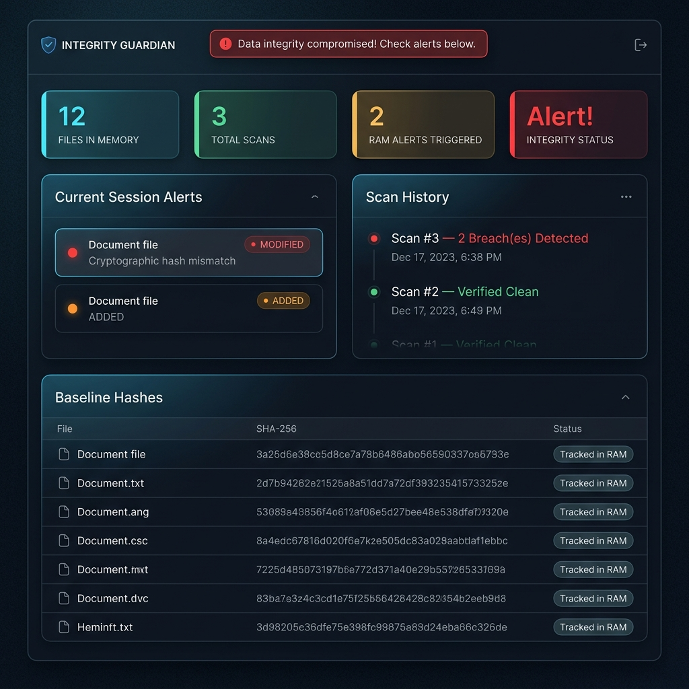

<p align="center">
  
</p>

<h1 align="center">🛡️ Kryptify</h1>

<p align="center">
  <b>Zero-Knowledge File Integrity Monitor — Runs Entirely in Your Browser</b>
</p>

<p align="center">
  <i>Detect unauthorized file modifications, additions, and deletions using SHA-256 cryptography — with zero servers, zero databases, and zero data leaving your device.</i>
</p>

<p align="center">
  
  
  
  
  
</p>

<p align="center">
  <a href="https://github.com/bijoymg2023/File_Integrity_Monitor/blob/main/LICENSE"></a>
  
  
  
  
</p>

<p align="center">
  <a href="#-what-is-kryptify">About</a> •
  <a href="#-problem-it-solves">Problem</a> •
  <a href="#-who-is-this-for">Users</a> •
  <a href="#-features">Features</a> •
  <a href="#%EF%B8%8F-tech-stack">Tech Stack</a> •
  <a href="#-how-it-works">How It Works</a> •
  <a href="#-installation">Install</a> •
  <a href="#-usage">Usage</a> •
  <a href="#%EF%B8%8F-screenshots--demo">Demo</a> •
  <a href="#-future-improvements">Roadmap</a> •
  <a href="#-license">License</a>
</p>

---

## 🧠 What is Kryptify?

**Kryptify** is a **100% client-side** file integrity monitoring (FIM) tool that implements core **cybersecurity / SIEM** concepts — but runs entirely within an isolated browser session, ensuring maximum privacy.

Unlike traditional FIM tools that require Python agents, cloud databases, and network access, Kryptify uses the browser's native **WebCrypto API** and **File System Access API** to hash your files, detect unauthorized changes, and present results in a premium dark-themed dashboard — all without a single byte of data ever leaving your device.

> **Double-click `index.html` → Select a folder → Detect file tampering instantly.**  
> No installation. No backend. No data stored. Close the tab = data gone forever.

---

## 🎯 Problem It Solves

Traditional file integrity monitoring tools are invasive, complex, and often require cloud infrastructure. Kryptify takes a radically different approach:

| Problem | Kryptify Solution |
|---|---|
| 🔧 **Requires installation** | Zero installation — just open an HTML file |
| ☁️ **Sends data to the cloud** | 100% local — zero network requests, ever |
| 🔑 **Needs admin privileges** | Runs in a browser sandbox with user permission |
| 💾 **Stores sensitive file hashes** | Session-only RAM storage — tab close = data gone |
| 🐍 **Requires Python/Node agents** | Pure JavaScript — no runtime dependencies |
| 💰 **Expensive enterprise tools** | Completely free and open source |
| 🔒 **Trust the vendor** | Zero-knowledge architecture — verify it yourself |

---

## 👥 Who Is This For?

| User | Use Case |
|---|---|
| 🛡️ **Cybersecurity Professionals** | Quick integrity checks without deploying agents |
| 🎓 **Students & Learners** | Hands-on learning of FIM, hashing, and SIEM concepts |
| 💻 **Developers** | Monitor config files, source code, and build artifacts |
| 🔬 **Security Researchers** | Tamper detection during malware analysis |
| 🏢 **Small Businesses** | Free alternative to enterprise FIM solutions |
| 🙈 **Privacy Advocates** | File monitoring with absolute zero data exposure |

---

## ✨ Features

### 🔐 Zero-Knowledge Architecture
- **Zero Installation** — No backend, no database, no Python script. Just double-click the HTML file
- **Native Local Access** — Uses the modern HTML5 `window.showDirectoryPicker()` to securely read local folders
- **In-Browser WebCrypto** — Uses your device's CPU to compute **SHA-256** hashes via `crypto.subtle.digest()`
- **Session-Only Memory** — All file paths, contents, and hashes stored exclusively in browser RAM
- **Absolute Privacy** — Close the tab and all data ceases to exist. Not a single byte is ever sent over the network

### 🔍 Change Detection Engine
- **File Modifications** — Detects when file content has been altered (hash mismatch)
- **File Additions** — Identifies new files not present in the original baseline
- **File Deletions** — Flags files that have been removed since the baseline was set
- **Recursive Scanning** — Crawls subdirectories to monitor entire folder trees
- **Smart Filtering** — Automatically skips hidden files and `node_modules`

### 📊 Real-Time Dashboard
- **Stat Cards** — Files in memory, total scans, alerts triggered, integrity status
- **Alert Feed** — Live session alerts with color-coded badges (Added / Modified / Deleted)
- **Scan History Timeline** — Chronological record of all scans with breach counts
- **Baseline Hash Table** — View all tracked files with their SHA-256 fingerprints
- **Toast Notifications** — Real-time feedback on every action

### 🎨 Premium UI/UX
- **Dark Glassmorphism** design with neon gradient accents
- Color-coded stat cards (Cyan / Green / Amber / Red)
- Responsive layout for all screen sizes
- Smooth loading animations and transitions
- Professional SIEM-style interface

---

## 🛠️ Tech Stack

| Technology | Purpose |
|---|---|
| **HTML5** | Semantic markup and structure |
| **Vanilla CSS** | Glassmorphism dark mode styling |
| **Vanilla JavaScript (ES6+)** | Async/await logic, DOM manipulation |
| **File System Access API** | Native browser directory reading |
| **WebCrypto API** | Hardware-accelerated SHA-256 hashing |

> **📦 Zero dependencies.** No npm, no frameworks, no build tools. Pure web standards.

---

## ⚙️ How It Works

```
┌─────────────────────────────────────────────────────────────────┐
│                        YOUR BROWSER                             │
│                                                                 │
│   1. SELECT FOLDER                                              │
│   ┌──────────────────┐     ┌────────────────────────────────┐   │
│   │  File System     │────▶│  Crawl all files recursively   │   │
│   │  Access API      │     │  (skip hidden & node_modules)  │   │
│   └──────────────────┘     └─────────────┬──────────────────┘   │
│                                          │                      │
│   2. COMPUTE HASHES                      ▼                      │
│   ┌──────────────────┐     ┌────────────────────────────────┐   │
│   │  WebCrypto API   │────▶│  SHA-256 digest for each file  │   │
│   │  (Hardware Acc.)  │     │  Store as baseline in RAM      │   │
│   └──────────────────┘     └─────────────┬──────────────────┘   │
│                                          │                      │
│   3. RUN INTEGRITY SCAN                  ▼                      │
│   ┌──────────────────┐     ┌────────────────────────────────┐   │
│   │  Re-hash all     │────▶│  Compare against RAM baseline  │   │
│   │  files from disk │     │  Detect: Added/Modified/Deleted│   │
│   └──────────────────┘     └─────────────┬──────────────────┘   │
│                                          │                      │
│   4. DISPLAY RESULTS                     ▼                      │
│   ┌─────────────────────────────────────────────────────────┐   │
│   │  Dashboard: Alerts │ History │ Stats │ Hash Table       │   │
│   └─────────────────────────────────────────────────────────┘   │
│                                                                 │
│   5. CLOSE TAB → ALL DATA DESTROYED 💨                          │
└─────────────────────────────────────────────────────────────────┘
```

---

## 📂 Project Structure

```
Kryptify/
├── index.html          # Main application (single page)
├── style.css           # Glassmorphism dark mode styles
├── script.js           # Zero-knowledge FIM engine
├── assets/
│   ├── banner.png      # Project banner
│   ├── dashboard.png   # Dashboard screenshot
│   └── breach_detected.png  # Breach detection screenshot
├── LICENSE             # MIT License
└── README.md           # You are here!
```

---

## 🚀 Installation

### Prerequisites

| Requirement | Details |
|---|---|
| **Browser** | Chromium-based (Chrome, Edge, Brave, Opera) |
| **OS** | Windows, macOS, or Linux |
| **Dependencies** | **None** — zero installation required |

### Option 1 — Clone with Git

```bash
git clone https://github.com/bijoymg2023/File_Integrity_Monitor.git
cd File_Integrity_Monitor
```

### Option 2 — Download ZIP

1. Click the green **Code** button on GitHub
2. Select **Download ZIP**
3. Extract the archive

### Launch

Simply **double-click `index.html`** — it opens directly in your browser. That's it. ✅

> **⚠️ Note:** Safari and Firefox are not supported due to their blocking of the File System Access API. Use Chrome, Edge, Brave, or Opera.

---

## 💻 Usage

### Quick Start

1. **Open `index.html`** in a Chromium-based browser

2. **Click `📁 Select Local Folder`** and grant permission when prompted

3. Kryptify will instantly:
   - Crawl the folder recursively
   - Hash every file with SHA-256
   - Store the baseline fingerprints in RAM

4. **Modify any file** in the monitored folder (add, edit, or delete)

5. **Click `🔍 Run Integrity Scan`** — the engine will instantly flag all changes!

### Example Workflow

```
Step 1: Select folder → ~/Documents/my-project
        ✅ Baseline established: 47 files hashed into RAM

Step 2: Edit "config.json" in a text editor
        Add a new file "backdoor.sh"
        Delete "logs/debug.log"

Step 3: Click "Run Integrity Scan"
        🚨 ALERT: 3 Breach(es) Detected!
        
        ● MODIFIED  config.json        — Cryptographic hash mismatch
        ● ADDED     backdoor.sh        — Not in baseline
        ● DELETED   logs/debug.log     — Missing from disk
```

### Dashboard Panels

| Panel | Description |
|---|---|
| 📁 **Files in Memory** | Total files being tracked in the RAM baseline |
| 🔍 **Total Scans** | Number of integrity scans performed this session |
| ⚡ **RAM Alerts** | How many scans detected integrity violations |
| 🔐 **Integrity Status** | Current state: Pending → Secure → Alert! |
| 🚨 **Session Alerts** | Detailed list of all detected changes |
| 📋 **Scan History** | Timeline of all scans with pass/fail status |
| 📄 **Baseline Hashes** | Table of all files with their SHA-256 fingerprints |

---

## 🖼️ Screenshots & Demo

<p align="center">
  <b>📊 Dashboard — Initial State</b><br/>
  <i>Clean interface ready to monitor files</i>
</p>

<p align="center">
  
</p>

<p align="center">
  <b>🚨 Breach Detected — Integrity Violation</b><br/>
  <i>File modifications, additions, and deletions flagged in real-time</i>
</p>

<p align="center">
  
</p>

---

## 🔮 Future Improvements

| Priority | Feature | Description |
|---|---|---|
| 🔴 High | **Export Scan Reports** | Download alerts and scan history as PDF/JSON |
| 🔴 High | **File Diff Viewer** | Show side-by-side content comparison for modified files |
| 🟡 Medium | **Scheduled Scans** | Auto-scan at configurable intervals using `setInterval` |
| 🟡 Medium | **Regex Ignore Patterns** | User-defined file/folder exclusion rules |
| 🟡 Medium | **Multiple Baselines** | Save and switch between multiple folder baselines |
| 🟢 Future | **IndexedDB Persistence** | Optional persistent baseline storage across sessions |
| 🟢 Future | **Service Worker** | Offline-capable PWA with background scanning |
| 🟢 Future | **File Size Tracking** | Monitor file size changes alongside hash changes |
| 🟢 Future | **Notification API** | Browser notifications for detected breaches |
| 🟢 Future | **Dark/Light Theme** | Toggle between dark and light mode |

---

## 🤝 Contributing

Contributions are welcome! Whether it's a bug fix, a UI improvement, or a new feature — every contribution counts.

1. **Fork** the repository
2. **Create** your feature branch:
   ```bash
   git checkout -b feature/amazing-feature
   ```
3. **Commit** your changes:
   ```bash
   git commit -m "feat: add amazing feature"
   ```
4. **Push** and open a **Pull Request**

### Contribution Ideas
- 🐛 Bug fixes and edge case handling
- 🎨 UI/UX improvements
- 📝 Documentation improvements
- 🧪 Additional hash algorithm support (SHA-384, SHA-512)
- ♿ Accessibility enhancements

---

## 📄 License

This project is **open source** and available under the **[MIT License](LICENSE)**.

```
MIT License — Copyright (c) 2026 Bijoy Mathew George

You are free to use, modify, and distribute this software
for both personal and commercial purposes.
```

See the [LICENSE](LICENSE) file for full details.

---

## 🙏 Acknowledgments

- **[Web Crypto API](https://developer.mozilla.org/en-US/docs/Web/API/Web_Crypto_API)** — Native browser cryptography
- **[File System Access API](https://developer.mozilla.org/en-US/docs/Web/API/File_System_Access_API)** — Secure local file access
- **[MDN Web Docs](https://developer.mozilla.org/)** — Comprehensive web API documentation

---

<p align="center">
  <b>Built with 🛡️ Pure Web Standards</b><br/>
  <sub>Kryptify — Trust nothing. Verify everything.</sub>
</p>

<p align="center">
  <a href="https://github.com/bijoymg2023/File_Integrity_Monitor/stargazers">⭐ Star this repo</a> if you find it useful!
</p>
